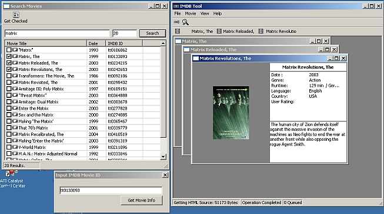



## IMDB Movie Info Tool

### Description

Connect to the Internet movie Database and Download detailed information, and box cover images for your favorite movies. Search for movies by title, Drag and Drop .NFO Files with IMDB Codes inside, Get movie info by IMDB Code. Note: this project is for informational and educational purposes only, I just wanted to see if I could make a GUI type program for a nice website, please support IMDB.com, it is a great service.
 
### More Info
 

             |
---                |---
**Submitted On**   |2004-09-26 18:07:08
**By**             |[Tecc](https://github.com/Planet-Source-Code/PSCIndex/blob/master/ByAuthor/tecc.md)
**Level**          |Advanced
**User Rating**    |5.0 (20 globes from 4 users)
**Compatibility**  |VB 6\.0
**Category**       |[Internet/ HTML](https://github.com/Planet-Source-Code/PSCIndex/blob/master/ByCategory/internet-html__1-34.md)
**World**          |[Visual Basic](https://github.com/Planet-Source-Code/PSCIndex/blob/master/ByWorld/visual-basic.md)
**Archive File**   |[IMDB\_Movie1798439282004\.zip](https://github.com/Planet-Source-Code/tecc-imdb-movie-info-tool__1-56401/archive/master.zip)

